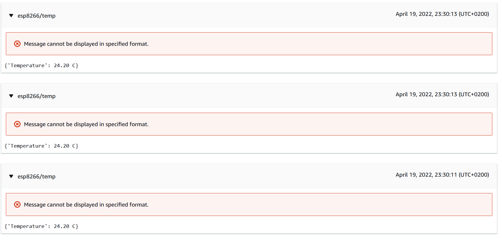

# ESP8266-MQTT-Client 

Before you build the project, create file with following name & define your credentials. 
`include/private_ssid_config.h`. Use `include/ssid_config.h` for reference. \ 
Note that `include/private_ssid_config.h` is git-ignored. 

## Build
`bash usb_reset.sh` \
`make`

## Build & Upload to board
`bash usb_reset.sh` \
`make flash`

## Display MQTT topic logs
Send data can be view through aws console.

